# Hero's Personal Training

Hero's Personal Training is a comprehensive web application designed to help users manage their fitness journey through personalized training and nutrition plans. Users can create and manage bookings for personal training sessions, track their progress, and receive customized workout and nutrition advice. The application also allows trainers to manage their clients and schedules efficiently.

[Live Site - Hero's Personal Training](LINK)

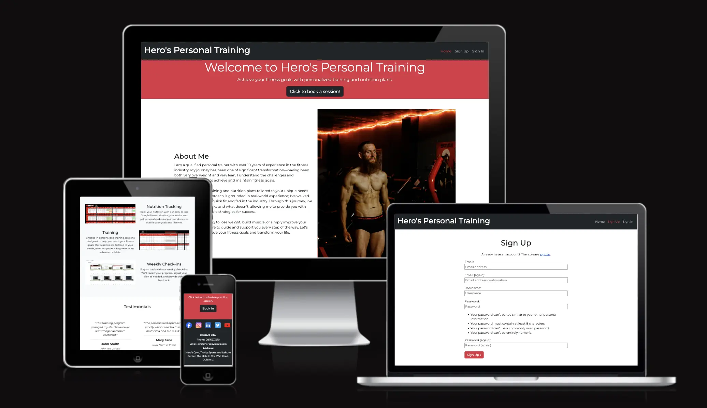

## Table of Contents
- [Hero's Personal Training](#heros-personal-training)
  - [Table of Contents](#table-of-contents)
  - [User Experience Design](#user-experience-design)
    - [Project Goals](#project-goals)
    - [Target Audience](#target-audience)
    - [Milestones & User Stories](#milestones--user-stories)
  - [Features](#features)
    - [Implemented Features](#implemented-features)
    - [Features Left to Implement](#features-left-to-implement)
  - [Technologies Used](#technologies-used)
  - [Database Design](#database-design)
  - [Site Design](#site-design)
    - [Wireframes](#wireframes)
  - [Security](#security)
  - [Testing](#testing)
    - [Functional Testing](#functional-testing)
  - [Deployment](#deployment)
    - [Version Control](#version-control)
    - [Heroku Deployment](#heroku-deployment)
    - [Running Locally](#running-locally)
  - [Credits](#credits)

## User Experience Design

### Project Goals

- Provide a user-friendly interface for booking and managing personal training sessions.
- Enable trainers to manage their schedules and client information efficiently.
- Offer personalized training and nutrition plans to users.
- Ensure the application is accessible on various devices, including desktops, tablets, and smartphones.

### Target Audience

- Individuals looking for personalized fitness and nutrition plans.
- Personal trainers who need an efficient way to manage their clients and schedules.
- Fitness enthusiasts who want to track their progress and achieve their fitness goals.

### Milestones & User Stories

#### Milestone 1: Base Setup

- USER STORY: As a developer, I need to set up the project so that it is ready for implementing core features.
- USER STORY: As a developer, I need to create the base.html page and structure so that other pages can reuse the layout.
- USER STORY: As a developer, I need to create static resources so that images, CSS, and JavaScript work on the website.
- USER STORY: As a developer, I need to create the footer with social media links and contact information.
- USER STORY: As a developer, I need to create the navbar so that users can navigate the website from any device.

#### Milestone 2: Standalone Pages

- USER STORY: As a developer, I need to implement a 404 error page to alert users when they access a non-existent page.
- USER STORY: As a developer, I need to implement a 500 error page to alert users when an internal server error occurs.
- USER STORY: As a developer, I need to implement a 403 error page to redirect unauthorized users.
- USER STORY: As a site owner, I would like a home page so that customers can view information about my services.

#### Milestone 3: Authentication

- USER STORY: As a developer, I need to implement allauth so that users can sign up and have access to the website's features.
- USER STORY: As a site owner, I would like the allauth pages customized to fit the site's styling.

#### Milestone 4: Booking Management 

- USER STORY: As a user, I would like to create a new booking when I want to schedule a training session.
- USER STORY: As a user, I would like to view my bookings to check the details.
- USER STORY: As a user, I would like to edit a booking to make changes when needed.
- USER STORY: As a user, I would like to delete a booking when I no longer need it.
- USER STORY: As a trainer, I want to be able to view all bookings to manage my schedule.

#### Milestone 5: Deployment

- USER STORY: As a developer, I need to set up Whitenoise to serve static files in deployment.
- USER STORY: As a developer, I need to deploy the project to Heroku to make it live for users.

#### Milestone 6: Documentation

- Complete README documentation
- Complete testing documentation write-up


The Kanban board was created using GitHub projects and can be viewed [here](https://github.com/users/defridge/projects/2/views/1). The user stores are organized into labels: Must have, Should have, and Could have. All user stories have a set of acceptance criteria that confirm when the stories have been completed.

## Features

### Implemented Features

1. **Site Navigation/Nav Menu:** 
  - ``USER STORY - As a developer, I need to create the navbar so that users can navigate the website from any device.``
  - The navigation menu contains different links depending on if a user is signed in or out or if a trainer has signed in.
  - if the user has not signed in links shown will be Home, Sign up and Sign in.
  - If the user has signed in the links shown will be Home, Create Booking, Manage Bookings, and Sign Out.
  - If a trainer has signed in the links shown will be Home, Manage Client Bookings, and Sign Out.
  - The links are displayed on all pages and the navigation menu collapses into the hamburger menu on smaller devices.

  
  
  

2. **Home Page:**
  - ``USER STORY - As a site owner, I would like a home page so that customers can view information about my services.``
  - When the app is loaded from the url the user is brought to the app home page.
  - The home page is made up of 5 sections:
    1. Hero Section - The hero section is a the top of the home page and includes a welcome message, and a "Book Session" button.
    2. About Me Section - Next we have a section that provides info and background about the trainer/trainers.
    3. Service Details Section - Provides the user with all the info on the services provided by the trainer/trainers.
    4. Testimonials Section - Client testimonials are displayed here.
    5. Call to Action Section - Displays company tag line and provides another button element that will allow users to make a booking.

  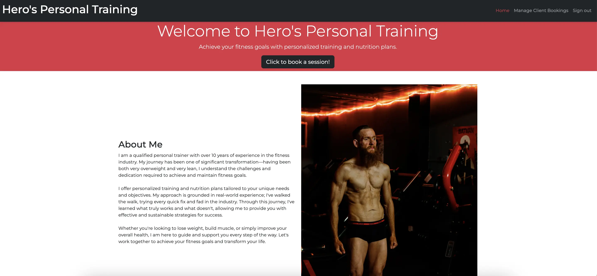
  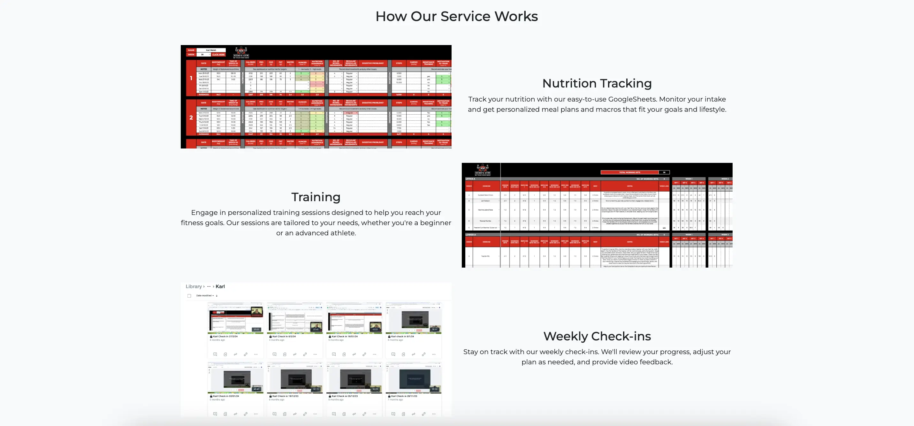
  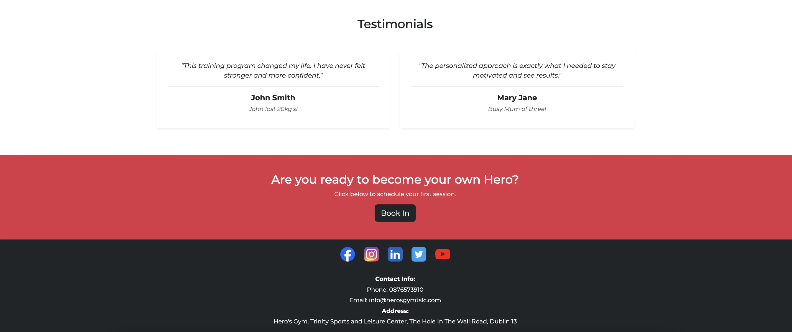

3. **Footer:**
  - ``USER STORY - As a developer, I need to create the footer with social media links and contact information.``
  - The footer section shows at the bottom of all pages.
  - contains all social page icons which link to the social media sites and open in a new tab.
  - Contains all relevant contact info and address.

  

4. **Sign Up:**
  - ``USER STORY - As a developer, I need to implement allauth so that users can sign up and have access to the website's features.``
  - The sign up page can be clicked on in the nav menu (if the user hasnt already signed in) or can accessed via the link in the sign up page.
  - The sign up form has 5 sections:
    1. Email - A user must enter a email address.
    2. Email (again) - A user must confirm the email address by inputting it again here.
    3. Username - A user must enter a username and it will be this username they use to sign into the account in the future.
    4. Password - A user must enter a password for their account here.
    5. Confirm password - a user must confirm their password here and it must match the password above.
  - If sign up has been successful the user will be redirected to the site home page.

  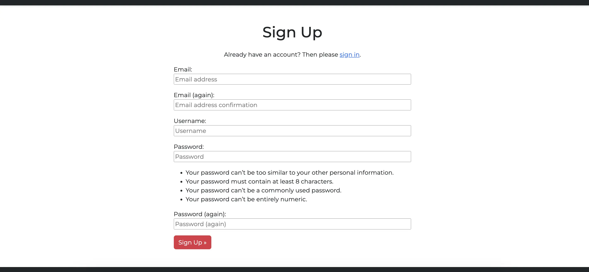

5. **Create Booking:**
  - ``USER STORY - As a user, I would like to create a new booking when I want to schedule a training session.``
  - The create booking page only shows when a user has registered with the site as a user and has logged in.
  - If a user has not signed in they will be redicted to the sign in page if they click the book now buttons on the home page.

  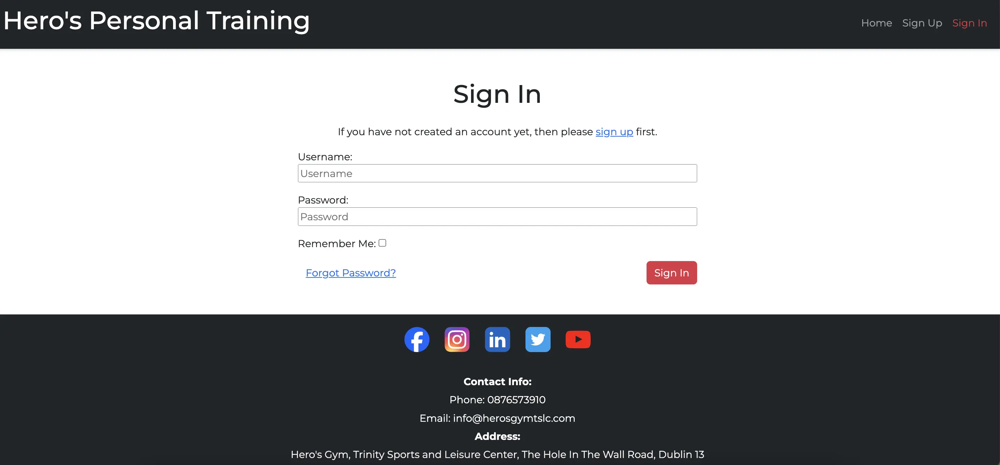

  - If a user has successfully sign in they will be sent to the create booking page.
  - The create booking form has 6 sections the user must fill in:
    1. Date - The user is asked to choose a date for their session.
    2. Time - The user will be asked to choose a a time for there session that are predetermined by the trainer (if the time is already booked the user will be asked to choose another time).
    3. Session Type - The user will have a choice between 2 session types: Consultation or Personal Training.
    4. Contact number - The user must enter a contact number.
    5. Email address - The user must enter a email address.
    6. Additional info - The user is asked to provide any additional info they feel is relevant or that theyd like the trainer to know before the first session.
  - If the suer leaves any section incomplete, except for the additional info section the form will not submit.

  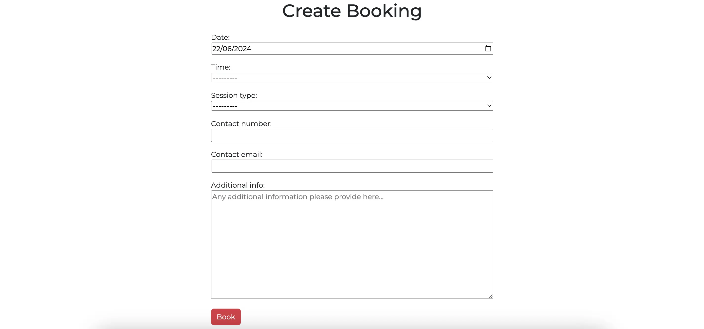

6. **Managing Bookings:**
  - ``USER STORY - As a user, I would like to view my bookings to check the details.``
  - ``USER STORY - As a user, I would like to edit a booking to make changes when needed.``
  - ``USER STORY - As a user, I would like to delete a booking when I no longer need it.``
  - On the manage booking page the user is able to see all the sessions they have booked with the trainer.
  - The are shown the session type, and the date and time it is due to take place.
  - From here the user will have 2 options to edit an existing booking and delete a booking.

  

  - If a user clicks edit they are taken to their original booking form with all the info they have already entered when making the booking.
  - From here the user can change any of the sections and save their changes or cancel them.

  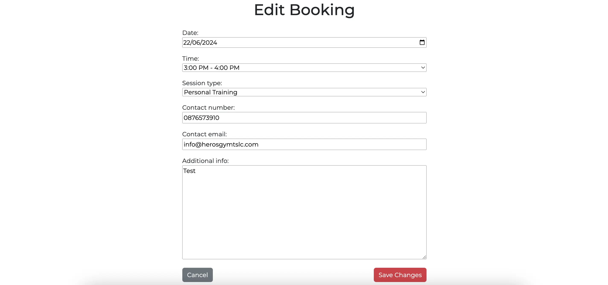

  - If a user clicks on delete they will be asked to confirm if they wish to delete their booking or can cancel the delete request.

  

7. **Trainer Booking Management:**
  - ``USER STORY - As a trainer, I want to be able to view all bookings to manage my schedule.``
  - At present the site allows for one trainer who is registered as staff via the admin page and can manage their clients bookings.
  - Once the trainer has logged is they can navigated to the manage client bookings page which will show in the navbar.
  - From here the trainer can see any and all bookings their clients have made.
  - They will have an overview page that is the same as the user bookings where they can see a list of all bookings which two options to either edit of delete the bookings.
  - The functionality of the edit and delete bookings is excalty that same as the user/client options outlined above

  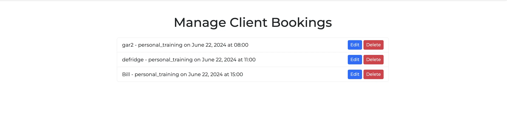

8. **Error Pages**
  - ``As a developer, I need to implement a 404 error page to alert users when they access a non-existent page.``
  - ``As a developer, I need to implement a 500 error page to alert users when an internal server error occurs.``
  - ``As a developer, I need to implement a 403 error page to redirect unauthorized users.``
  - If a user navigates to a broken link/missing page then a custom 404 error page will be displayed that easily helps the user get back to the home page without using the browser back buttons.
  - A 500 error page has been displayed to alert users when an internal server error occurs. The message relays to users that the problem is on our end, not theirs.
  - A 403 error page has been created and styled to match the other error pages in look and functionality, however at present there is no reason why this error page would be raised with this project.

9. **Base Setup and Other User Stories**
  - ``As a developer, I need to set up the project so that it is ready for implementing core features.``
  - ``As a developer, I need to create the base.html page and structure so that other pages can reuse the layout.``
  - ``As a developer, I need to create static resources so that images, CSS, and JavaScript work on the website.``
  - ``As a site owner, I would like the allauth pages customized to fit the site's styling.``
  - All the above user stories have been implemented in order to complete all the features of the app as outlined above.
  
### Features Left to Implement

1. **Social Media Integration:**
    - Allow users to share their progress on social media platforms.

2. **In-App Messaging:**
    - Enable communication between trainers and clients within the app.

3. **Multiple Trainers:**
    - Have multiple trainers on the app

4. **Progress Tracking:**
    - Log workouts and track progress.
    - View progress over time with visual charts.

## Technologies Used

- **Frontend:**
  - HTML5, CSS3, JavaScript
  - Bootstrap 5

- **Backend:**
  - Python, Django

- **IDE:**
  - GitPod (Visual Studio Code Online)

- **Database:**
  - PostgreSQL

- **Version Control:**
  - Git, GitHub

- **Deployment:**
  - Heroku

- **Site Syling:**
  - Google Fonts, Favicon.io, uxwing.com

- **Image Processing**
  - convertio.co, TinyPNG

### Python Modules Used in the Project

#### Standard Python Modules:
- `os`: Used for accessing environment variables and handling file paths.
- `timezone`: Used for managing date and time operations.
- `forms`: Used for creating forms.
- `models`: Used for creating database models.

#### Django Modules:
- `django`: The primary framework for building the application.
- `django.contrib.admin`: Provides the Django admin interface.
- `django.contrib.auth`: Provides authentication framework.
- `django.contrib.contenttypes`: Supports generic relations between models.
- `django.contrib.sessions`: Manages user sessions.
- `django.contrib.messages`: Provides a messaging framework.
- `django.contrib.staticfiles`: Manages static files.
- `django.contrib.sites`: Enables multi-site support.
- `django.template.backends.django.DjangoTemplates`: Used for template rendering.
- `django.template.context_processors`: Provides context processors for templates.
- `django.middleware`: Provides various middleware classes for processing requests.
- `django.db`: Provides database management functionalities.

#### Third-Party Modules:
- `dj_database_url`: Used for parsing database URLs.
- `allauth`: Provides authentication, registration, account management, and more.
- `allauth.account`: Extends `allauth` for account management.
- `allauth.socialaccount`: Extends `allauth` for social account management.
- `whitenoise.middleware.WhiteNoiseMiddleware`: Serves static files in production.

#### Environment Management:
- `env`: For accessing environment variables.

#### Other Modules:
- `django.contrib.messages.constants as messages`: Provides constants for message tags.
- `django.forms`: Provides form handling.

### External Python Modules

- `asgiref==3.8.1`: ASGI (Asynchronous Server Gateway Interface) reference implementation and utilities.
- `dj-database-url==0.5.0`: Utility to parse database URLs.
- `Django==4.2.13`: The web framework used to build the project.
- `django-allauth==0.57.2`: Integrated set of Django applications addressing authentication, registration, account management, and third-party (social) account authentication.
- `gunicorn==20.1.0`: Python WSGI HTTP Server for UNIX.
- `oauthlib==3.2.2`: A generic and thorough implementation of the OAuth request-signing logic.
- `psycopg2==2.9.9`: PostgreSQL database adapter for Python.
- `PyJWT==2.8.0`: JSON Web Token implementation in Python.
- `python3-openid==3.2.0`: Python OpenID support.
- `requests-oauthlib==2.0.0`: OAuthlib support for Python Requests.
- `sqlparse==0.5.0`: A non-validating SQL parser.
- `whitenoise==5.3.0`: Radically simplified static file serving for WSGI applications.

## Database Design

### Database Design Summary for the Booking Model

The `Booking` model represents the core of the database design for the application. It is used to manage and store information about personal training and consultation sessions booked by users. Below is a summary of the database design based on the provided `Booking` model.

#### Models

1. **User Model**
   - **User**: Provided by Django's built-in authentication system (`django.contrib.auth.models.User`).
     - This model manages user-related data including username, password, email, etc.

2. **Booking Model**
   - **Booking**: Custom model for storing booking information.
     - Fields:
       - **user**: Foreign key to the `User` model, representing the user who made the booking.
       - **date**: DateField to store the date of the booking. Defaults to the current date.
       - **time**: CharField to store the time of the booking. Uses predefined choices for different time slots.
       - **session_type**: CharField to store the type of session. Uses predefined choices for "Consultation" and "Personal Training".
       - **duration**: IntegerField to store the duration of the session in minutes. Defaults to 60 minutes.
       - **contact_number**: CharField to store the user's contact number.
       - **contact_email**: EmailField to store the user's contact email.
       - **additional_info**: TextField to store any additional information provided by the user. Has a default value and cannot be blank or null.
     - **Meta**:
       - `unique_together = ('date', 'time')`: Ensures that each combination of date and time is unique, preventing double bookings for the same time slot.
     - **Methods**:
       - `__str__(self)`: Returns a string representation of the booking, including the username, session type, date, and time.

#### Choices for Fields

1. **SESSION_TYPE_CHOICES**
   - Defines the types of sessions available for booking:
     - `('consultation', 'Consultation')`
     - `('personal_training', 'Personal Training')`

2. **TIME_CHOICES**
   - Defines the time slots available for booking:
     - `('08:00', '8:00 AM - 9:00 AM')`
     - `('09:00', '9:00 AM - 10:00 AM')`
     - `('10:00', '10:00 AM - 11:00 AM')`
     - `('11:00', '11:00 AM - 12:00 PM')`
     - `('14:00', '2:00 PM - 3:00 PM')`
     - `('15:00', '3:00 PM - 4:00 PM')`
     - `('16:00', '4:00 PM - 5:00 PM')`
     - `('17:00', '5:00 PM - 6:00 PM')`

#### Database Relationships

- **One-to-Many Relationship**:
  - The `Booking` model has a foreign key relationship with the `User` model. This means that each user can have multiple bookings, but each booking is associated with a single user.

#### Constraints

- **Unique Constraint**:
  - The combination of `date` and `time` must be unique across all bookings to prevent double-booking the same time slot.

This design ensures that the application can effectively manage user bookings, including preventing conflicts and storing all necessary information related to each booking.

## Site Design

### Colour-Scheme

For this website the primary colors are Black (#212529), Red (#DC3545), and White (#ffffff). The black in mainly used in the nav and footer elements, with some buttons such as call-to-action button being black also. The red is used to give a nice contrast to the black nav and footer elements and is used on most of the buttons throughout the site. White is mainly used for all the page backgrounds. These 3 colours match the colour scheme of the pictures used on the site home page and I really like how these all work together to give a clean and professional look.

### Typography

The Montserrat font was used throughout the website. This font is from google fonts and was imported into the style sheet.

### Imagery

All images on the site are owned by the site designer.

### Wireframes

- Home page Desktop

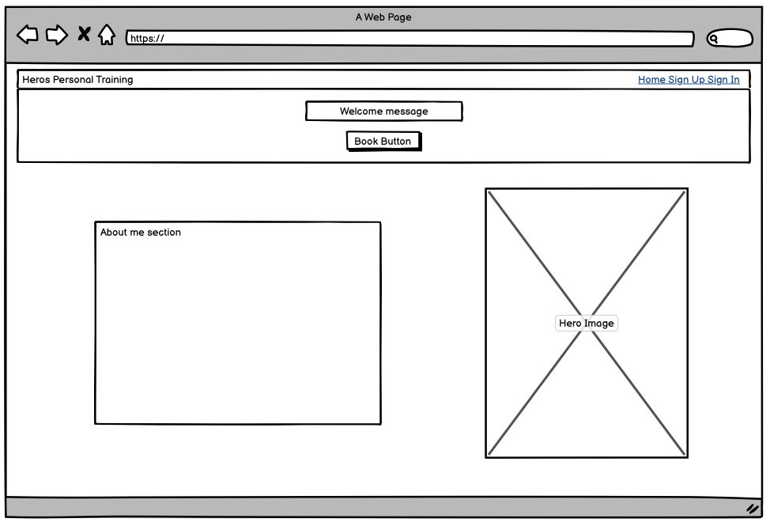

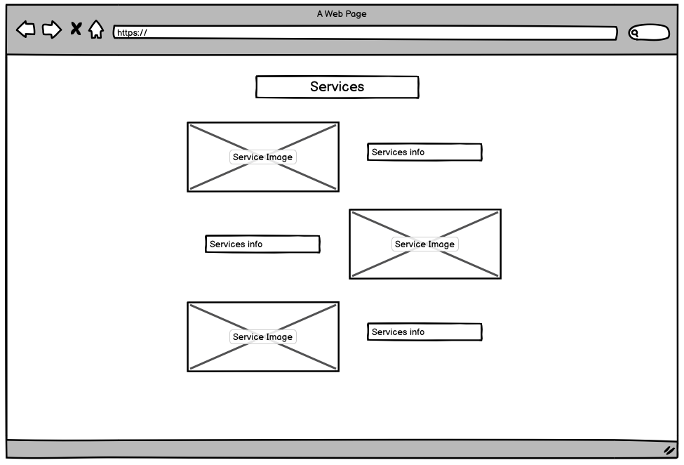

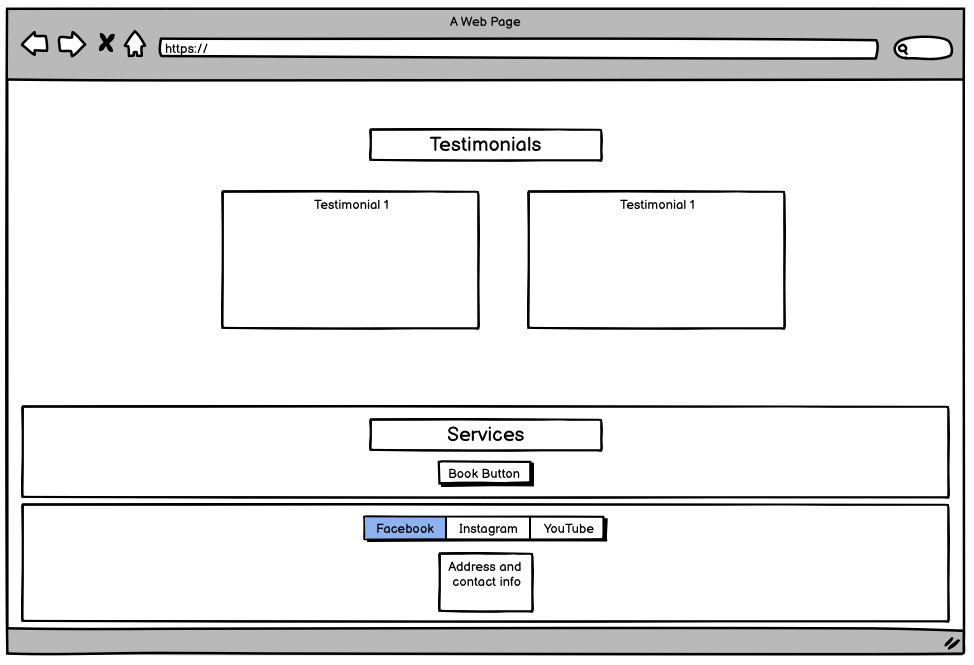

- Sign Up Page Desktop

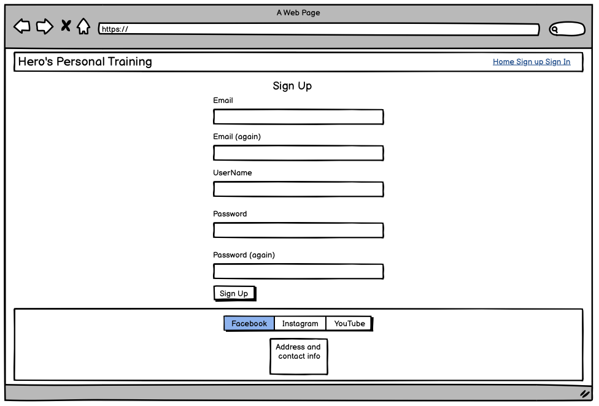

- Sign in Page Desktop

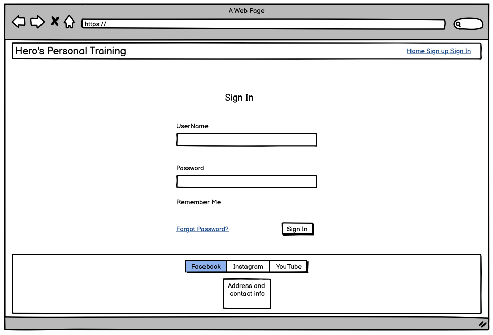

- Create Booking Page Desktop

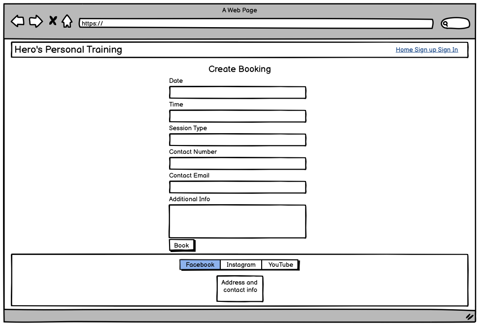

- Booking Confirmation Page Desktop

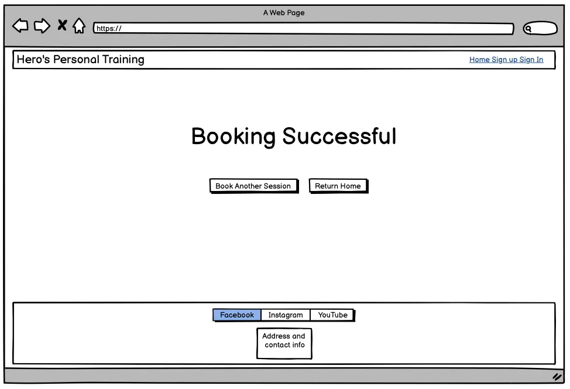

- Manage Boking Page Desktop / Manage Client Bookings Page Desktop

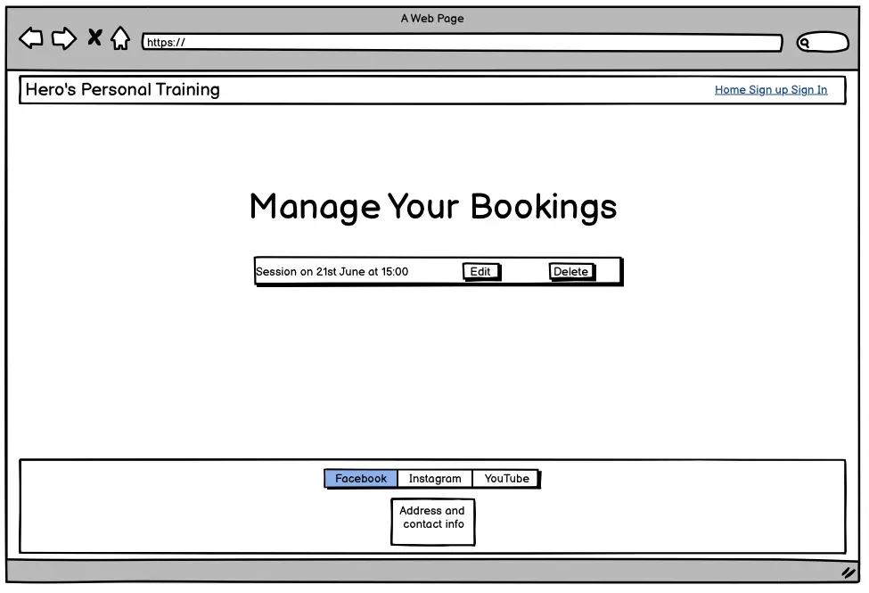

- Edit Booking Page Desktop / Edit Client Bookings Page Desktop 

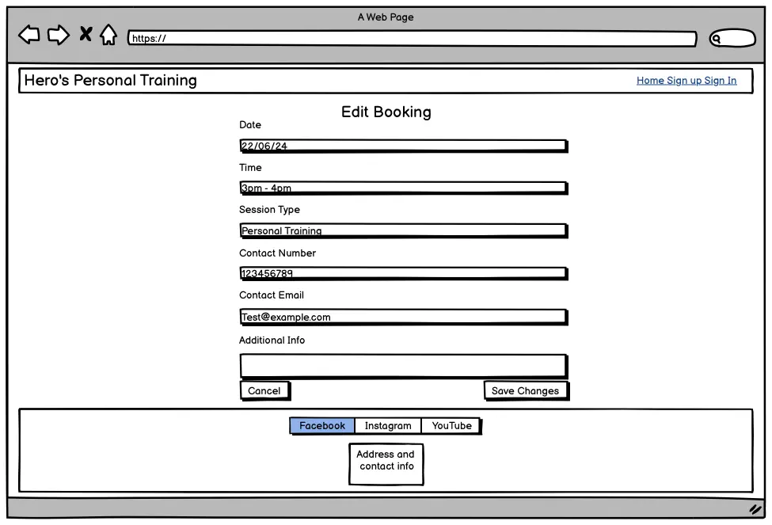

- Delete Booking Page Desktop / Delete Client Bookings Page Desktop

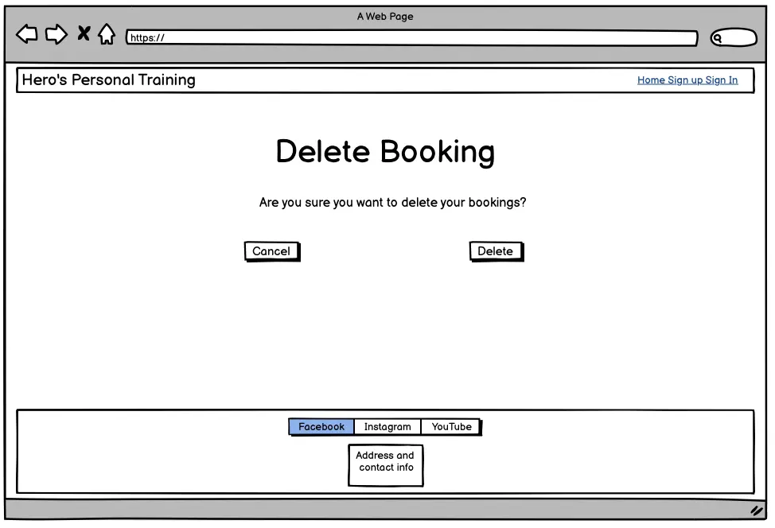

- Sign Out Page Desktop

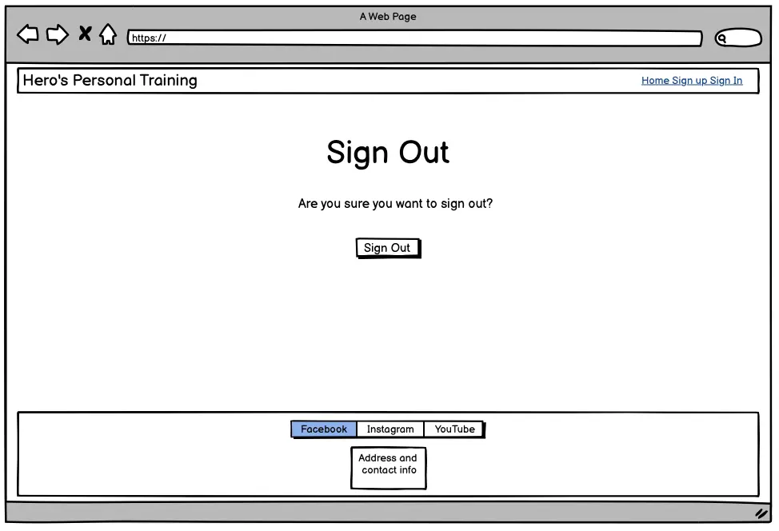

- Home Page Mobile

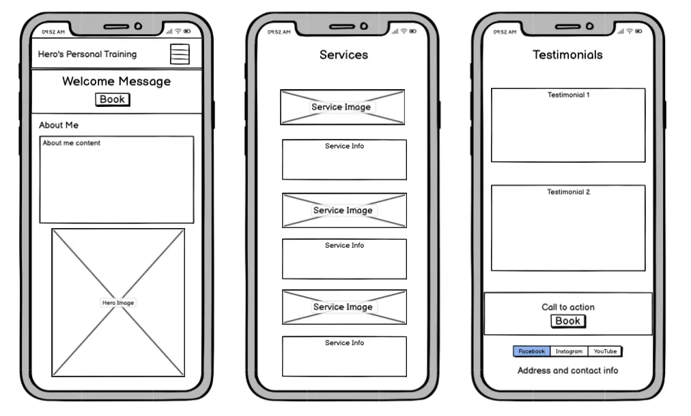

- Sign Up, Sign In, Sign Out Mobile

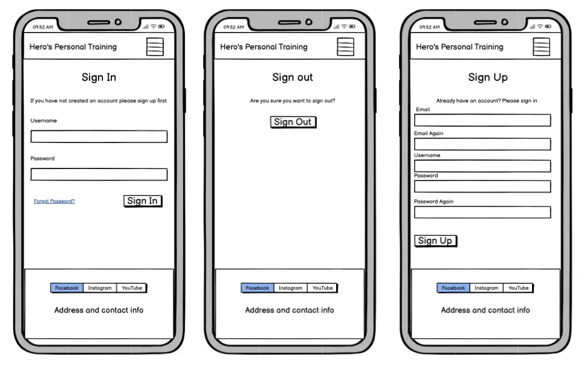

- Booking Pages Mobile

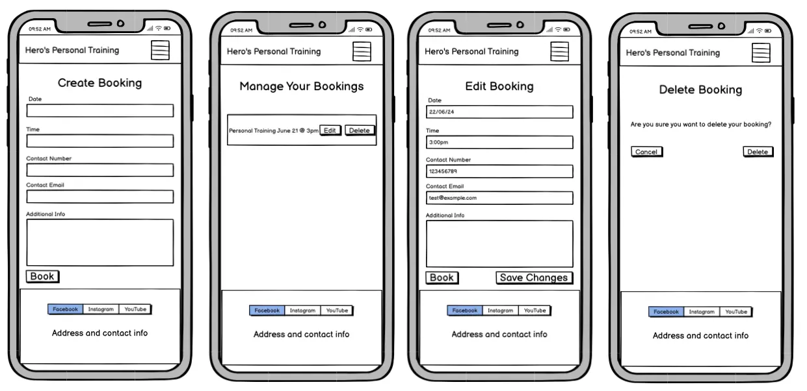

## Security

Views were setup to check login details to see if the person us a user or staff(trainer) and depending on the outcome only certain page links would be shown in the navbar.

Environment variables were stored in an env.py for local development for security purposes to ensure no secret keys, api keys or sensitive information was added the the repository. In production, these variables were added to the heroku config vars within the project.

## Testing

### Functional Testing

**Authentication**

Description:

*Test if a user can sign up to the website*

Steps:

1. Navigate to [Hero's Personal Training](LINK) and click Sign Up in the navbar
2. Enter all relevant details, Email, Username, Password
3. Click Sign up button

Expected:

Site redirects back to the home page with a message displayed on top of the page saying Successfully signed in as "Username".

Actual:

Site redirects back to the home page with a message displayed on top of the page saying Successfully signed in as "Username".

---

Description:

*Test if a user can sign in once they have signed up to the website*

1. Navigate to [Hero's Personal Training](LINK) and click Sign In in the navbar
2. Enter all relevant details, Username, Password
3. Click Sign in button

Expected:

Site redirects back to the home page with a message displayed on top of the page saying Successfully signed in as "Username".

Actual:

Site redirects back to the home page with a message displayed on top of the page saying Successfully signed in as "Username".

---

Description:

*Test if a trainer can sign in once they have been assigned as staff*

1. Navigate to [Hero's Personal Training](LINK) and click Sign In in the navbar
2. Enter all relevant details, Username, Password
3. Click Sign in button

Expected:

Site redirects back to the home page with a message displayed on top of the page saying Successfully signed in as "Username".

Actual:

Site redirects back to the home page with a message displayed on top of the page saying Successfully signed in as "Username".

---

Description:

*Test if a user can sign out of the website*

Steps:

1. Sign in to the website
2. Click the Sign Out in the navbar
3. Click Sign out button on the confirm sign out page

Expected:

User is signed out and redirected back to the site home page with a message displayed at the top of the page saying You have signed out.

Actual:

User is signed out and redirected back to the site home page with a message displayed at the top of the page saying You have signed out.

---

Description:

*Test if a trainer can sign out of the website*

Steps:

1. Sign in to the website
2. Click the Sign Out in the navbar
3. Click Sign out button on the confirm sign out page

Expected:

Trainer is signed out and redirected back to the site home page with a message displayed at the top of the page saying You have signed out.

Actual:

Trainer is signed out and redirected back to the site home page with a message displayed at the top of the page saying You have signed out.

---

**User Booking**

Description:

*Test if a user can create a booking*

Steps:

1. Navigate to [Hero's Personal Training](LINK) and click Sign In in the navbar
2. Sign in with correct user details (username and password)
3. Click on Create Booking page in the navbar
4. Enter the following details:
    - Date: (Datepicker) 07/07/2024
    - Time: (Dropdown) 8:00am - 9:00am
    - Session Type: (Dropdown) Personal Training
    - Contact Number: 123456789
    - Contact Email: test@example.com
    - Additional Info: (Textbox) Test info
5. Click book

Expected:

User is taken to booking success screen telling them the booking was successful and allows them to make another booking or return to home page.

Actual:

User is taken to booking success screen telling them the booking was successful and allows them to make another booking or return to home page.

---

Description:

*Test if a user can edit booking*

Steps:

1. Navigate to [Hero's Personal Training](LINK) and click Sign In in the navbar
2. Sign in with correct user details (username and password)
3. Click on Manage Bookings page in the navbar
4. Click edit button assigned to personal_training session at 8am on 07/07/2024
4. Edit the following details:
    - Time: (Dropdown) 8:00am - 9:00am
    - Change time to 9:00am - 10:00am
5. Click save changes

Expected:

User is taken back to manage booking screen where the edited session time is reflected.

Actual:

User is taken back to manage booking screen where the edited session time is reflected.

---

Description:

*Test if a user can delete a booking*

Steps:

1. Navigate to [Hero's Personal Training](LINK) and click Sign In in the navbar
2. Sign in with correct user details (username and password)
3. Click on Manage Bookings page in the navbar
4. Click delete button assigned to personal_training session at 9am on 07/07/2024
5. Click delete on confirmation screen

Expected:

User is taken back to manage booking screen where the delete booking has now been removed.

Actual:

User is taken back to manage booking screen where the delete booking has now been removed.

---

**Trainer Booking Management**

Description:

*Test if a trainer can view all user bookings*

Steps:

1. Navigate to [Hero's Personal Training](LINK) and click Sign In in the navbar
2. Sign in with correct trainer details (username and password)
3. Click on Manage Client Bookings page in the navbar

Expected:

Trainer should see a full list of all bookings made by all users from that date onwards.

Actual:

Trainer should see a full list of all bookings made by all users from that date onwards.

---

Description:

*Test if a trainer can edit user bookings*

Steps:

1. Navigate to [Hero's Personal Training](LINK) and click Sign In in the navbar
2. Sign in with correct trainer details (username and password)
3. Click on Manage Client Bookings page in the navbar
4. Click edit button on any of the user bookings
5. Edit any one field of the user booking:
    - Date: Currently set at 01/07/2024
    - Date: Change to 02/07/2024
6. Click save changes button

Expected:

Trainer is redirected back to manage booking screen where the date change is reflected.

Actual:

Trainer is redirected back to manage booking screen where the date change is reflected.

---

Description:

*Test if a trainer can delete user bookings*

Steps:

1. Navigate to [Hero's Personal Training](LINK) and click Sign In in the navbar
2. Sign in with correct trainer details (username and password)
3. Click on Manage Client Bookings page in the navbar
4. Click delete button on any of the user bookings
5. Confirm the deletation

Expected:

Trainer is redirected back to manage booking screen where deleted session has been removed

Actual:

Trainer is redirected back to manage booking screen where deleted session has been removed

---

**Navigation Links**

Testing was performed to ensure all navigation links on the respective pages, navigated to the correct pages as per design. This was done by clicking on the navigation links on each page.

- Home -> index.html
- Sign Up -> signup.html
- Sign In -> login.html
- Create Booking -> create_booking.html
- Manage Booking -> manage_bookigs.html
- Manage Client Bookings -> manage_client_bookings.html
- Sign Out -> logout.html

All navigation links directed to the correct pages as expected.

---

**Footer**

Testing was performed on the footer links by clicking the uxwing icons and ensuring that the social media icon opened their corresponding pages in a new tab. These all behaved as expected.

---

**Page Buttons**

Testing was preformed on all buttons of the website and no issues where found. All functioned as expected.

---

### Negative Testing

Testing was preformed on create booking to ensure:

1. A user cannot book a session for a date in the past.
2. A user cannot book if any of the fields in the create booking form have been left blank.
3. A user cannot book a time slot on a date if it has already been booked by someone else.
4. A user can only enter numbers into the contact number field.
5. A user mst enter a correct email format in contact email field.

### Unit Testing

Unit tests were created to test some basic functionality such as templates used, redirects and booking options. These can be found in the tests.py files in the respective apps.

Results:

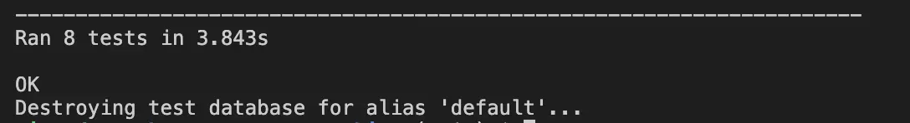

### Accessibility

The [Wave Accessibility](https://wave.webaim.org/) was used to check the accessibility of the site. The details of the report can be found below:

- Errors: No errors where found on any pages of the site.
- Contrast Errors: When run origanlly a contrast error was found with the color of the active nav links with the background. This was changed and upon reinspection no issues where found
- Alerts: 2 redundant links where found along with 1 suspicious alternative text and 1 suspicious link text. Upon inspection these where found to be none-issues and as such where left as they were.
- Structural Elements: No issues where found with any of the structural elements on the website.
- ARIA: All links have been provided with appropriate aria-labels on the site.

### Validator Testing

All pages were run through the [w3 HTML Validator](https://validator.w3.org/). Only issue found was the use of two `<h1>` tags on some of the pages which was rectified by changing the second one to `<h2>` tags instead.

Due to the django templating language code used in the HTML files, these could not be copy and pasted into the validator so to test the validation on the files the source page was opened and this was copied straight to the page to validator page.

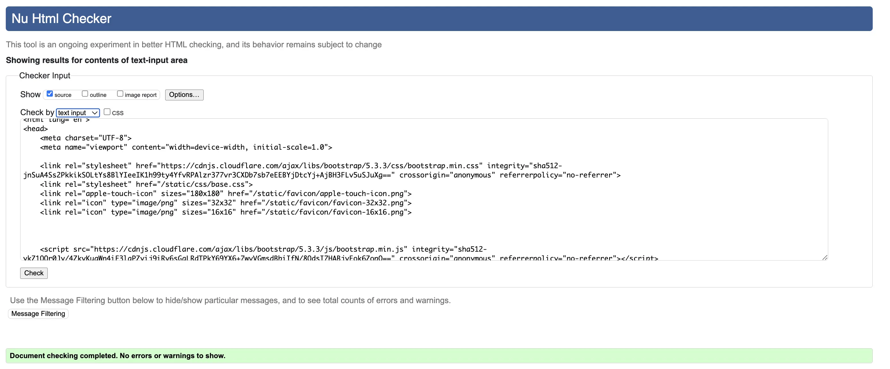

#### HTML Validator

#### Python Validator

All python code was checked using the [Pep8](https://pep8ci.herokuapp.com/) validator to ensure code was Pep8 compliant. I did have some errors with lines having too many characters, trailing whitespace, or line spacing but all have been fixed and now all pages run through without any issues. An exception to this is the setting.py file that shows too many characters with the AUTH_PASSWORD_VALIDATORS and I was unable to resolve this.

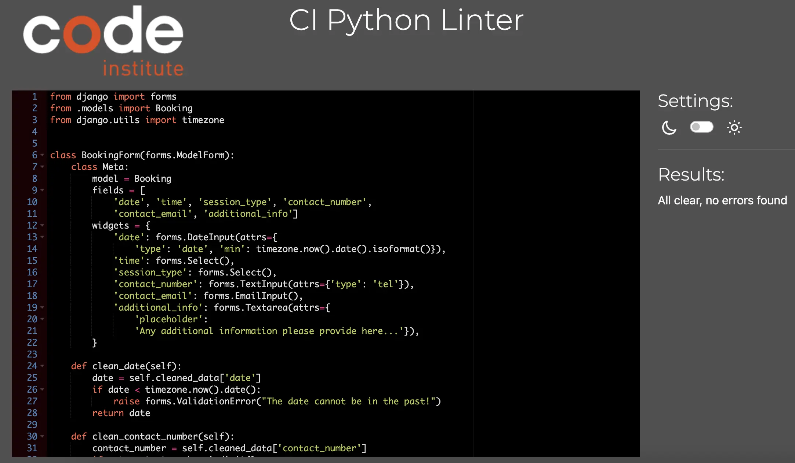

#### CSS Validator

The CSS was checked using the [Jigsaw W3C](https://jigsaw.w3.org/css-validator/#validate_by_input) validator and no issues where found with the code.

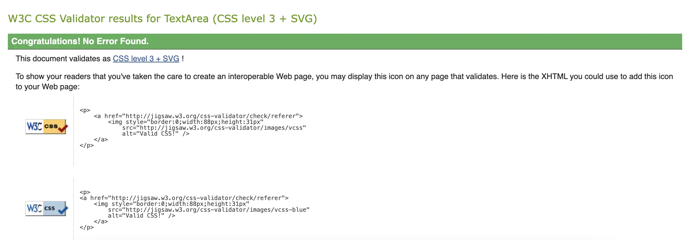

### Lighthouse

The lighthouse report showed good scores across the board in Preformace, Best Practices, Accessibility and SEO.

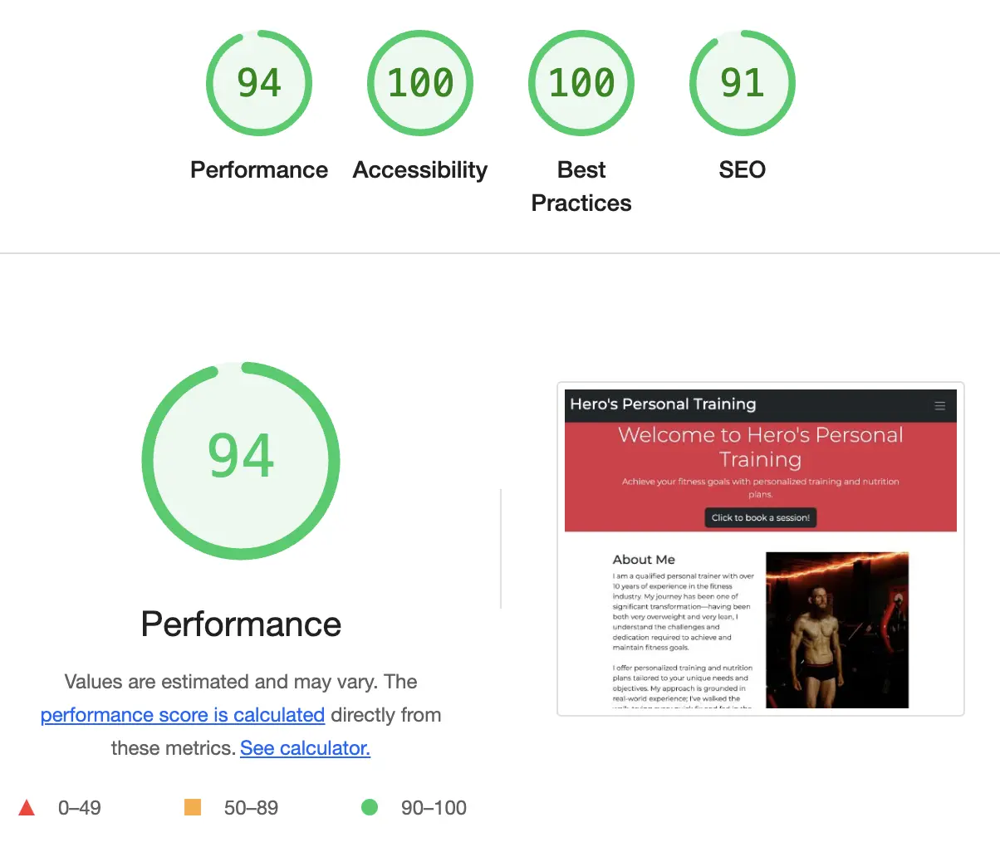

### Responsiveness

- The website was tested on various screen sizes from Galaxy Fold 280px upwards and is responsive and functions as intended.
- To test this the webpage was loaded in a browser and using Google Dev Tools was changed to 280px and then the responsive window was dragged to max size.
- The web page responded as intended.
- Some devices the website was tested on outside of Dev Tools were: Iphone 11, Samsung A6, Macbook Air, HP M27fw FHD monitor.

## Deployment

### Version Control

The site was created using the Visual Studio Code editor and pushed to github to the remote repository.
The following git commands were used throughout development to push code to the remote repo:
- ```git add .``` - This command was used to add all changes to the staging area before they are committed.
- ```git commit -m “commit message”``` - This command was used to commit changes to the local repository queue ready for the final step.
- ```git push``` - This command was used to push all committed code to the remote repository on github.

### Heroku Deployment

Below are the steps to deploy the project on Heroku:

- Navigate to heroku and create an account
- Click the new button in the top right corner
- Select create new app
- Enter app name
- Select region and click create app
- Go to the settings tab and then click reveal config vars
- Add the following config vars:
  - SECRET_KEY: (Your secret key)
  - DATABASE_URL: (Value of ElephantSQL URL)
- Click the deploy tab
- Scroll down to Connect to GitHub and sign in / authorize when prompted
- In the search box, find the repositoy you want to deploy and click connect
- Scroll down to Manual deploy and choose the main branch
- Click deploy

The app should now be deployed.

The live link can be found here: [Live Site](LINK)

### Run Locally

Navigate to the GitHub Repository you want to clone to use locally:

- Click on the code drop down button
- Click on HTTPS
- Copy the repository link to the clipboard
- Open your IDE of choice
- Type git clone copied-git-url into the IDE terminal

The project will now have been cloned on your local machine for use.

## Credits

"Credit where credit is due"
1. [w3Schools](https://www.w3schools.com/django/index.php) was referred to through the whole project as a reference and refresher on Django concepts
2. During the project I purchased a Django course on [udemy.com](https://www.udemy.com/course/python-django-2021-complete-course/learn/lecture/27267960?start=0#overview) so as to become more proficent in building Django apps
3. As a test run of my ability to use Django I done a code along project with Dee Mc by following her brilliant guide on [Youtube](https://www.youtube.com/watch?v=sBjbty691eI&list=PLXuTq6OsqZjbCSfiLNb2f1FOs8viArjWy&index=4)
4. My mentor Gareth McGirr for keeping me on track!
